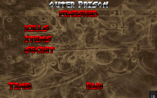
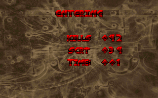

# DoomDB

DoomDB runs Doom inside Oracle Database. The browser is a thin static
canvas/audio client: it sends keyboard or touch commands through generated ORDS
AutoREST procedures and displays frames returned by Oracle. There is no external
game server and no prerecorded route in the play path.

Open the local dashboard at <http://localhost:8080/> and the current playable
client at <http://localhost:8080/play/> while the Compose stack is running.

## Current status

The active implementation path is **P13: database-authoritative multiplayer**.
Single-player is playable end to end on the local stack. New `/play/` sessions run the
pinned GPLv3 `AXDOOMER/mochadoom` engine (commit `c0af1322…abe93`) as Java
schema objects inside OJVM, owned by a long-lived Scheduler worker session and
reached only through generated ORDS AutoREST. The previous clean-room SQL/PLSQL
engine (phases P0–P7) remains intact and independently executable as the
differential and visual oracle.

What works today, all verified by repeatable gates:

- **Playable game.** Title screen, WAD-native menus, skill selection, dynamic
  movement/turning/fire/use, doors and lifts, monsters, damage, authored audio
  events, pause/automap/menu, GOD/ALL/NOCLIP/FULLMAP verification cheats,
  save/load with lineage forking, and exact replay
  — every displayed pixel selected inside Oracle, every input a database
  transaction.
- **Determinism and recovery.** Frames and state carry SHA-256 identities; the
  append-only `ticcmd_t` ledger reconstructs a killed or restarted worker to
  the identical frame chain; duplicate requests replay byte-identical
  responses; concurrent sessions are isolated by generation fencing.
- **30 FPS locally.** Repeated 300-frame moving/combat routes through the real
  HTTP/browser pipeline hold 30–32 displayed FPS with paint-gap p95 ≤ 33.3 ms
  and 300/300 unique frames (frame-chain SHA `a1888c88…4be900` reproduced
  across independent runs).
- **Full skill-3 route.** An authentic, no-cheat E1M1 run reaches the
  intermission at tic 13,272 with the expected combat, resources, keyed door,
  lift, secret, and exit interactions. A fresh Oracle session replayed every
  command with 13,272/13,272 exact state, frame, and response hashes.
- **Playable multiplayer checkpoint.** `/play/multiplayer` now lets two browser
  sessions privately create, join, ready, and play one database-authoritative
  co-op world through generated AutoREST. The engine advances once per ordered
  command vector and returns distinct player POVs; a live two-browser gate
  reached synchronized tic 24 with dynamic input and reload/reconnect. Forced
  worker loss now reconstructs the exact state/POV chain in a replacement
  generation and preserves accepted partial input. Guest leave is recorded at
  an exact tic as `NEUTRAL_LEFT`; the membership bitmap becomes one-player,
  only the surviving POV is rendered, and that frontier reconstructs exactly.
  The exact internal vanilla consistency ring now survives reborn boundaries;
  a formerly failing 4,082-tic route prefix advances beyond tic 4,200. The
  accepted single-player E1M1 command streams do not transfer unchanged to
  co-op: both the 762-tic skill-1 line and the full 13,272-tic skill-3 line
  leave a healthy player against different geometry instead of reaching the
  exit. Private, opt-in per-tic pose traces now isolate that first netgame
  divergence without adding work to normal gameplay. The authored co-op exit,
  300-frame multiplayer FPS gate, and soak remain in progress.
- **Operational resilience (2026-07-19).** Worker claims self-heal when the
  Oracle Scheduler loses an async job dispatch; dead claims are reclaimed;
  when all four worker slots are busy the least-recently-active idle worker is
  evicted (bounded, deterministic, durable-state reconstruct) so a new player
  is never refused; the eleven-gate Mocha regression suite passes from a fully
  occupied pool.
- **Fresh-stack multiplayer hardening (2026-07-20).** Empty ORDS config volumes
  now install cleanly, republish the allowlisted AutoREST API after repository
  replacement, and preserve the fixed six-session pool. Oracle's persisted
  SPFILE is rebuilt with a 256 MiB Java-pool floor; the lifecycle and retained
  match HTTP gates pass after a real container recreation, including exact
  generation recovery and tic-zero reconstruction.
- **Bounded active multiplayer storage.** Each live match keeps tic zero and a
  128-tic response ring (two 64 KB POVs per tic) plus its latest two native
  checkpoints. The compact ordered command/state ledger stays complete for
  exact replay; a live 160-tic gate proved the BLOB counts stop growing.
- **Long-route hardening.** A complete 6,336-command save/load lineage export
  now replays byte-exactly through public AutoREST. That route exposed an
  unsigned fine-angle audio lookup after tic 8,006; the clean-room overlay now
  masks the cyclic lookup exactly like vanilla Doom, and the formerly failing
  branch advances normally through tic 8,048 after worker reconstruction.
- **Fast new games.** A pre-warmed standby worker constructs the next Mocha
  engine ahead of the claim, cutting a new game from ~17 s cold to ~1.4 s —
  proven byte-exact with a cold construction (identical frame/state/payload
  SHA chains). The skill menu additionally overlaps any remaining
  construction with a speculative default-skill allocation.
- **Oracle MODEL fire.** The complete 150-frame, 160×96 title-fire operation
  ran twice at full size inside Oracle. Both runs produced the same 604,369
  canonical RLE rows, all frame hashes, and animation SHA
  `b1eac353…e4ba`; the resulting APNG and exact-frame strip are reviewed.

Key verified numbers (local two-core Oracle Free stack):

| Measurement | Result |
| --- | --- |
| Engine step + render + BLOB (warm, p95) | 3.2–3.9 ms |
| Durable tic with ledger + synchronous commit (p95) | ~20 ms |
| Displayed FPS, two independent 300-frame routes | 30.75–32.05 |
| New game, standby-claimed vs cold construction | ~1.4 s vs ~17 s |
| Tic-zero frame SHA-256 | `a1c9b037…d3b5` |
| IWAD BLOB (SecureFile, SHA-verified) | 28,795,076 bytes |

What is left (see [PLAN.md](PLAN.md) §7 for the task cards):

- **P13** — finish the capability-secured AutoREST lobby, deterministic retained
  match worker, authentic two-browser co-op exit route, remaining interaction
  fixtures, deathmatch expansion, and local multiplayer soak/performance gates.
- **P9 is complete** — the Oracle `MODEL`-clause title fire animation passed
  two independent full-size database runs, deterministic checks, mutation
  checks, and visual review.
- **T12.1/T12.2** — after multiplayer, rerun the full golden-preserving local
  300-frame performance protocol against the finished architecture.
- **P11 (last)** — only after those local gates, deploy the static client to real
  S3 and the database/AutoREST surface to Autonomous Database, then repeat the
  packaged correctness, security, recovery, and performance protocol in cloud.

Full measurements, rejected alternatives, and acceptance gates are maintained
in [PLAN.md](PLAN.md), the
[P12.M OJVM performance report](reports/performance-P12.M-mochadoom-ojvm-2026-07-18.md),
the [2026-07-19 outage triage](reports/task-T12.M-triage-2026-07-19.md),
and [reports/](reports/).

## Reviewed database output

The selected Mocha-in-OJVM engine reached the authentic E1M1 intermission at
tic 13,272; this exact frame was reproduced by the fresh-session replay:



These 320×200 frames are frozen goldens from the previous Oracle SQL renderer,
which remains the independent visual oracle during migration.

| Gameplay | Automap |
| --- | --- |
|  |  |

| Menu | Intermission |
| --- | --- |
|  |  |

The database-generated Oracle `MODEL` title fire is also frozen and reviewed:


The legacy E1M1 route also reached the real exit at tic 4,118 with an exact,
database-rendered intermission frame:



## Target architecture

```text
static browser client
        │ generated AutoREST: single-player + capability-secured match API
        ▼
ORDS connection pool
        ▼
Oracle Database
  durable commands, checkpoints, hashes, events, and response BLOBs
        ▼
  retained Scheduler session per game/match + AQ generation fence
        ▼
  one authoritative headless Mocha world → per-player indexed frames
```

ORDS resets request-session PL/SQL and Java state after every request, so a
bounded long-lived Scheduler session owns each warm engine. ORDS remains the
only browser API, Oracle remains the only server runtime, and the browser never
simulates or renders the world itself.

## Run locally

Create local-only secrets from the fake templates, install pinned Node
dependencies, and start the stack:

```sh
cp secrets/oracle_password.txt.example secrets/oracle_password.txt
cp secrets/doom_password.txt.example secrets/doom_password.txt
npm ci
docker compose up -d
```

On a new database volume, bootstrap once and restart ORDS:

```sh
docker compose wait db
./scripts/bootstrap.sh
docker compose restart ords
```

Then visit <http://localhost:8080/play/>. The database-owned title screen leads
to New Game and skill-selection menus before allocating a Mocha Doom game inside
OJVM. Click or press Enter to begin; the game remains windowed.
The visible menus are composed from the pinned Freedoom IWAD's original Doom
patches served by Oracle; browser HTML supplies accessibility targets only.
Controls are W/S or Up/Down to move, A/D or Left/Right to turn, F or Ctrl to
fire, Space to use, Tab for the Doom menu, M for the automap, P to pause, and V
to toggle audio.
Escape is deliberately reserved for the browser so one key never races three
behaviors: one press releases the captured mouse and exits fullscreen when active.
Once gameplay starts, click the game to capture the cursor; horizontal mouse
movement turns and left-click fires. On macOS, rapid double-Control presses
trigger the host's Dictation prompt in a windowed browser. Canvas clicks never
enter fullscreen. Use the dedicated top-right Fullscreen button to explicitly
enter fullscreen Keyboard Lock, which captures both Ctrl keys so firing never
opens that prompt. Leaving fullscreen restores the windowed capture.

Real credentials, wallets, private keys, environment files, WADs, generated
classes/JARs, and Terraform variable files are ignored by
[.gitignore](.gitignore); only explicit fake `*.example` templates are tracked.

## Verify

```sh
./verify.sh env
./verify.sh secrets
./verify.sh task T7.3
./verify.sh evaluator-self-test
```

See [reports/](reports/) for implementation, performance, and review evidence.
