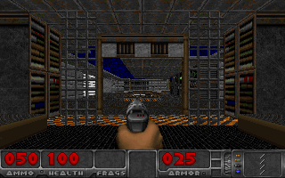
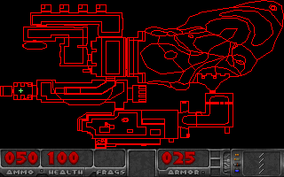
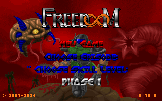
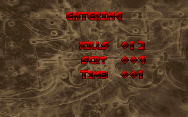

# DoomDB

DoomDB renders and simulates Doom inside Oracle Database. Oracle owns the map,
game state, collision, combat, world machines, history, and frame construction;
the browser is a thin canvas/audio client.

The project is under active implementation against the contracts in
[PLAN.md](PLAN.md). The local review dashboard is currently served at
<http://localhost:8080/> when the Compose stack is running.

## Current database output

These are reviewed 320×200 frames produced from database output and frozen as
visible goldens.

| Gameplay | Automap |
| --- | --- |
|  |  |

| Menu | Intermission |
| --- | --- |
|  |  |

Additional reviewed views include the
[shotgun HUD](goldens/t5.4/game-shotgun.png),
[paused game](goldens/t5.4/game-paused.png),
[normal automap](goldens/t5.4/automap-normal.png), and the
[R2 masked/sprite diagnostics](goldens/t5.3/).

## Status

As of July 2026:

| Phase | State | Result |
| --- | --- | --- |
| P0–P3 | Complete | Contracts, reproducible stack, WAD ingestion, schema, geometry, BSP, BLOCKMAP, REJECT, and graph gates pass. |
| P4 | Complete | First-light renderer and three human-reviewed database frames. |
| P5 | Complete | R2 portals, clipping, floors/ceilings, sky, masked textures, sprites, weapon/HUD/menu/pause/automap/intermission; reviewed goldens frozen. |
| P6 | Complete | Deterministic tic transaction, movement/collision, world machines, history, save/load, rewind, and replay gates pass. |
| P7 | Complete | Inventory, weapons, pickups, monsters, projectiles, combat, audio, concurrency, lifecycle, mutation, and Chromium gates pass. |
| P8 | Active | Full legitimate E1M1 completion route is being re-authored after an exact boundary-leak regression was found and fixed. Presentation workflow sources are staged. |
| P9–P10 | Source ready | MODEL-fire, production AutoREST API, thin TypeScript client, and local E2E harness are authored; live acceptance follows P8. |
| P11 | External target pending | Autonomous Database and S3 scripts are ready; real cloud acceptance requires the deployment credentials and targets. |
| P12 | Pending | Golden-preserving profiling and optimization follows completed local/cloud acceptance. |

The latest collision correction rejects sector changes that do not cross a
finite open portal while preserving direct portals, two-hop thin door throats,
and exact endpoint tangency. Its exact leak regression and all adjacent P6/P7
suites pass. A standalone corrected public 163-tic replay runs in about 31
seconds on the constrained local Oracle container. A separate evaluator-lab
prefix was interrupted after 237 seconds while overlapping another database
workload, so isolated evaluator/full-replay timing is still being measured and
is not yet an accepted performance result.

## Is it playable yet?

Not interactively. The complete R2 presentation renderer is correct and
reviewable, but the current measured full 320×200 database frame takes about
25.7 seconds (roughly 0.04 FPS): approximately 18.7 seconds for world rows and
4.6 seconds for the masked layer. The dashboard is useful for visual review;
real-time playability is a P12 performance objective after correctness and
end-to-end acceptance are complete.

## Local review

The repository pins Node, npm, Oracle Free, and ORDS versions. Local credentials
must be created from the deliberately fake examples and remain outside Git:

```sh
cp secrets/oracle_password.txt.example secrets/oracle_password.txt
cp secrets/doom_password.txt.example secrets/doom_password.txt
npm ci
docker compose up -d
```

Then open <http://localhost:8080/>. The database can take several minutes to
become healthy on its first boot.

Run the environment and secret checks with:

```sh
./verify.sh env
./verify.sh secrets
```

Real credentials, wallets, private keys, environment files, and Terraform
variable files are ignored by [.gitignore](.gitignore). Only explicit fake
`*.example` templates are intended to be committed.

## Verification

Task gates use the repository's evaluator contract:

```sh
./verify.sh task T7.3
./verify.sh evaluator-self-test
```

See [PLAN.md](PLAN.md) for the complete acceptance matrix and
[reports/](reports/) for implementation and review evidence.
